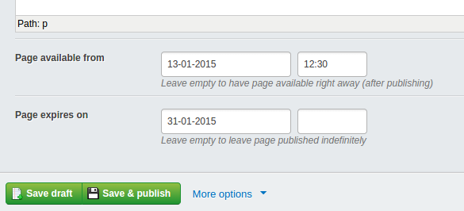

#SoftScheduler 
##non-cron Embargo & Expiry Module

This module allows you to specify when a page should become available (embargo) and when it should expire. It's called 'softscheduler' because it doesn't take care of publishing or unpublishing pages. Instead it checks if a published page should be available according to its set embargo/expire dates.

- Someone that is logged in as an admin will always be able to see the page.
- Setting both values as blank will mean the page is always visible.
- If the embargo time and/or date are blank, the page will be displayed until it expires.
- If the expiry time and/or date are blank, the page will be displayed once it embargos, and wont expire.


## Screenshots

*Schedule pages to become available/expire on certain dates & times*



## Installation

```
composer require micschk/silverstripe-softscheduler dev-master
```

Apply as Extension to pagetypes requiring scheduling (eg. NewsItems)

```yaml
---
name: 'schedulerextension'
---
NewsGridPage:
  extensions:
    - 'EmbargoExpirySchedulerExtension'
```

##Usage Overview

This doesn't work with staticpublisher and requires extra check to work well with partialcaching

Check for use in partialcaching:
$publishedStatus

Convenience function is supplied to add extra 'where' for DB queries (TODO: apply via augmentSQL, [see for example](https://github.com/micmania1/silverstripe-blogger/blob/1.0/extensions/BlogPostFilter.php))

```php
// workaround for Embargo/Expiry (augmentSQL for embargo/expiry is not working yet);
if( $class::has_extension("EmbargoExpirySchedulerExtension") ){
	$items = $items->where( EmbargoExpirySchedulerExtension::extraWhereQuery($class) );
}
```

##Requirements

SilverStripe 3.0+